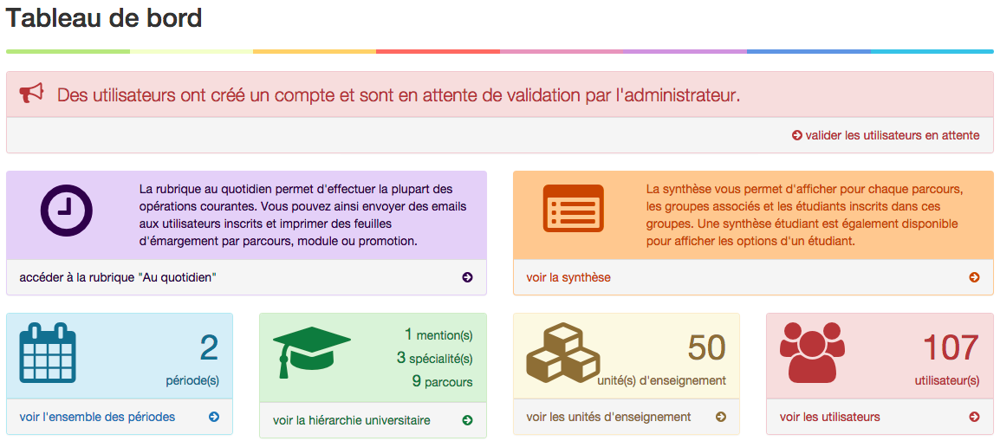
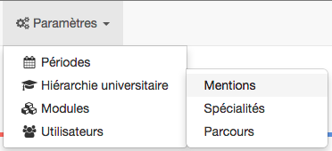
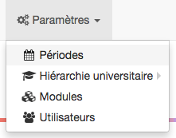
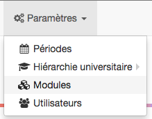
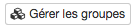
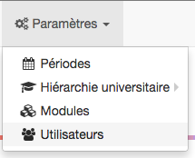
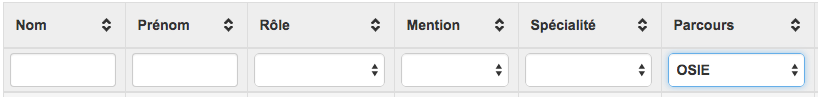
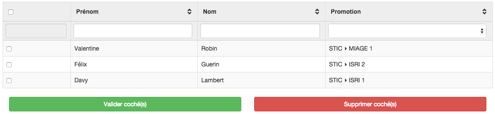

Utiliser le tableau de bord
===========================

Le tableau de bord est un point d'accès rapide aux différentes informations de l'application.

.. note::
   En cas d'utilisateurs en attente de validation, l'interface vous le signale par la présence d'un bandeau rouge en en-tête. Se référer à la partie Gestion des utilisateurs pour davantage d'information sur la validation de comptes utilisateurs.

En haut du tableau de bord, deux widgets sont présent et vous permettent d'accéder aux modules "Au quotidien" et "Synthèse". Davantage d'information sur ces modules sont présentes dans la "Documentation professeur/secrétariat".

La ligne du dessous regroupe des statistiques sur les différentes données saisies dans l'application (nombre de périodes, aperçu de la hiérarchie universitaire, nombre de modules et d'utilisateurs). 

   Le tableau de bord accessible à l'administrateur.

Créer la hiérarchie universitaire
=================================

La première chose à faire est de créer ce que nous avons appelé la "hiérarchie universitaire". La hiérarchie universitaire définit les diplômes et formations.

   Le menu permettant d'accéder au paramétrage de la hiérarchie universitaire.

Mentions
--------

Les mentions sont tout en haut de la hiérarchie et représentent le Master. Par exemple, STIC ou encore SANTÉ.

Spécialités
-----------

Les spécialités représentent une spécialisation du Master. Par exemple, pour le Master STIC, les mentions MIAGE, ISRI ou 2IBS représentent les spécialités.

Parcours
--------

Au sein d'une même spécialité peuvent être présents différents parcours. Les parcours permettent de différencier certains enseignements au sein d'une même spécialité. 

Ainsi, pour le Master STIC MIAGE, on aura les parcours :

- Tronc commun (année 1),
- OSIE (année 2)
- 2COM (année 2)
- SIS (année 2)

.. note::
   Le parcours étant l'élément terminal de la hiérarchie universitaire dans GICO, il doit être systématiquement présent. Si une spécialité ne comporte pas de parcours, créez tout de même un parcours "tronc commun".

Créer les périodes
==================

Les périodes servent à déterminer de quand à quand ont lieu les enseignement et les dates entre lesquelles les utilisateurs peuvent effectuer leurs choix.

Il est possible de créer autant de période que nécessaire. Chaque période pourra ensuite être associée à des groupes qui composeront les unitées d'enseignement. Une même période peut-être utilisée pour plusieurs groupes.

Vous pouvez accéder à la gestion des périodes depuis le tableau de bord, en cliquant sur **voir l'ensemble des périodes**.

Il est également possible d'accéder aux périodes depuis le menu **Paramètres** > **Périodes**.

   Le menu permettant d'accéder à la gestion des périodes.

Définir les enseignements
=========================

Créer les modules (unités d'enseignement)
-----------------------------------------

Pour créer un module, depuis le tableau de bord, cliquer sur **voir les unités d'enseignement**, puis sur le bouton vert **+ nouveau module**, en haut, à droite de l'écran.

Il est également possible d'accéder aux modules depuis le menu **Paramètres** > **Modules**.

   Le menu permettant d'accéder au paramétrage des modules.

Les modules ou unités d'enseignement sont une simple coquille vide qui viendra contenir les groupes. Un module est simplement défini par un code module et un libellé.

Associer des groupes aux modules
--------------------------------

Les modules sont composés de groupes. Les groupes peuvent-être associés à un ou plusieurs parcours et permettent de réserver un nombre de place (la capacité du groupe) pour l'ensemble des étudiant faisant partie des parcours.

Un groupe est associé à une période.

Depuis la liste des modules, il est possible de définir, pour chaque module, des groupes.

   Le bouton permettant d'accéder à la gestion des groupes d'un module.

Cliquez sur le bouton **Gérer les groupes** du module pour lequel vous souhaitez créer un/des groupes puis sur **+ Nouveau groupe**.

Vous pouvez créer autant de groupe que nécessaire par module.

Notion de groupes obligatoires
^^^^^^^^^^^^^^^^^^^^^^^^^^^^^^

Si l'administrateur coche la case **Les étudiants associés aux parcours de ce groupe doivent-être obligatoirement présents**, il définit alors la présence des étudiants dans ce groupe comme **obligatoire**.

Lorsqu'un groupe est obligatoire, sa capacité n'est plus pertinente et — même si sa saisie reste obligatoire — elle ne sera pas prise en compte par l'application.

Un groupe **obligatoire** permet d'affecter de facto l'ensemble des étudiants enregistré dans les parcours associés au groupe obligatoire au groupe (et donc au module parent). De cette façon, l'application est capable de générer des feuilles d'émargement complètes pour les modules mixant présence optionnelle et présence obligatoire en fonction des parcours.

Gérer les utilisateurs
======================

Vous pouvez accéder à la gestion des utilisateurs depuis le tableau de bord, en cliquant sur **voir les utilisateurs**.

Il est également possible d'accéder aux modules depuis le menu **Paramètres** > **Utilisateurs**.

   Le menu permettant d'accéder à la gestion des utilisateurs.

Filtres et tris
---------------

L'application dispose de filtres sur tableaux qui vous permettent de filtrer rapidement et de rechercher des utilisateurs par saisie de leur prénom et/ou nom et par sélection du rôle, de la mention, de la spécialité ou du parcours.

   Le filtre sur tableau du module Utilisateurs.

Vous pouvez également trier chaque colonne en faisant un simple clic pour un tri ascendant ou un double clic pour un tri descendant.

Valider les utilisateurs
------------------------

Lorsqu'un utilisateur s'inscrit, il est nécessaire de valider son compte afin que celui-ci puisse effectuer son choix d'options.

.. note::
   Tant que l'administrateur n'a pas validé les comptes des utilisateurs en attente de validation, ces derniers ne seront pas en mesure de se connecter à l'application et d'effectuer leur choix d'options.

Si des utilisateurs sont en attente de validation, cela est signalé dans le tableau de bord par un encart rouge. Il suffit alors de cliquer sur **-> valider les utilisateurs en attente**.

Il est également possible d'accéder à l'écran de validation des utilisateurs par le menu **Paramètres** > **Utilisateurs** puis en cliquant sur le bouton vert, en haut, à droite "Valider les utilisateurs".

Pour valider les utilisateurs, sélectionnez les utilisateurs à valider en cochant les lignes souhaitées puis cliquez sur **Valider cocher**. 

Si au contraire vous souhaitez supprimer les utilsiateurs cochés, cliquez sur **Supprimer cochés**.

   Écran de validation ou suppression des comptes utilisateurs.

Les filtres sur tableaux vous permettent de sélectionner facilement les utilsateurs que vous souhaitez valider ou supprimer.

Pour cocher l'ensemble des utilisateurs, cliquez sur la case à cocher dans l'en-tête sur tableau.

.. note::
   Si vous commencez par cocher l'ensemble des utilisateurs puis que vous appliquez un filtre, les utilisateurs ne répondant pas au critère de filtre seront automatiquement décochés de façon à ce que vous ne validiez ou supprimiez pas de façon accidentelle des utilisateurs non souhaités.

Modifier le mot de passe d'un utilisateur
-----------------------------------------

Pour modifier le mot de passe d'un utilisateur qui l'aurait oublié, commencez par afficher la liste des utilisateurs depuis le menu **Paramètres** > **Utilisateurs**. 

Cherchez ensuite l'utilisateur par saisie de son nom à l'aide des filtres sur tableau puis cliquer sur le bouton **Voir**.

Cliquez sur **modifier mon profil** puis sur **modifier mot de passe**.

Saisir deux fois le nouveau mot de passe et valider.

Consulter les choix d'un utilisateur
------------------------------------

Pour afficher les choix d'un utilisateur, commencez par afficher la liste des utilisateurs depuis le menu **Paramètres** > **Utilisateurs**. 

Cherchez ensuite l'utilisateur par saisie de son nom à l'aide des filtres sur tableau puis cliquer sur le bouton **Voir**.

Les choix de l'utilisateur s'affichent dans la partie droite de l'écran.